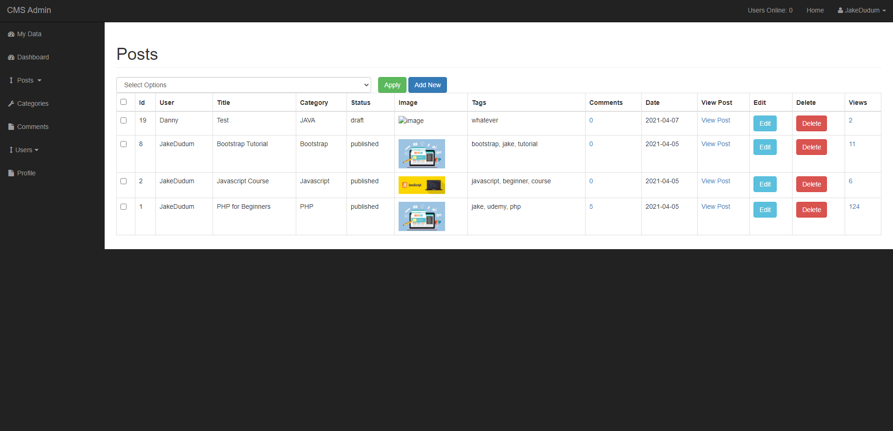

# Udemy-PHP-CMS

A CMS built with PHP that allows visitors to view approved posts and comments in various categories. Users can register on the site and start making posts and comments as well as new categories. There is a password recovery system for resetting one's password. Admins can approve posts and comments in order for them to be viewed on the site by everyone and are also capable of making other users into admins. There is a contact page for sending messages to me (Jake Dudum) about the site. This project was built from a Udemy course and the links for the course and instructor can be found in the [Acknowledgments](#Acknowledgments) section.

# Deployed Site
https://frozen-waters-48792.herokuapp.com/

# Home

# Registration

# Login

# Contact

# User Dashboard

# Admin Dashboard

# Posts

# Add Post

# Categories

# Comments

# Users

# Add User

# Profile

# Built With
- [HTML](https://developer.mozilla.org/en-US/docs/Learn/HTML)
- [CSS](https://developer.mozilla.org/en-US/docs/Web/CSS)
- [Bootstrap](https://getbootstrap.com/)
- [Javascript](https://developer.mozilla.org/en-US/docs/Web/JavaScript)
- [jQuery](https://jquery.com/)
- [PHP](https://www.php.net/)
- [Composer](https://getcomposer.org/)
- [MySQL](https://www.mysql.com/)
- [XAMPP](https://www.apachefriends.org/index.html)

# Composer Packages Used
- [Phpmailer](https://github.com/PHPMailer/PHPMailer)

# Future Improvements
######
| Goal | Completed? |
| --------------- | --------- |
| Switch to MVC folder Structure | ❌ |
| Implement Laravel framework | ❌ |
| Improve display of categories in navbar and add new page to view all categories alphabetically | ❌ |
| Fix password recovery email feature | ❌ |
######

# Versioning
- [Github](https://github.com/)

# Authors
### [Jake Dudum](https://github.com/JakeDudum)

# Acknowledgments
Starter code provided by [Edwin Diaz](https://www.udemy.com/user/edwin166/) in his Udemy Course [PHP for Beginners - Become a PHP Master - CMS Project](https://www.udemy.com/course/php-for-complete-beginners-includes-msql-object-oriented/)